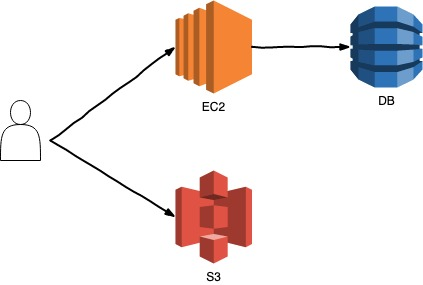

# Server

## 용어

- 정적서버(web server)
- 동적서버(web application server - was)

## 사전준비

- [AWS CLI 설치하기](./aws-cli.md)
- [python 설치하기](https://medium.com/@psychet_learn/python-%EA%B8%B0%EC%B4%88-2%EC%9E%A5-python-%EC%84%A4%EC%B9%98-%EB%B0%8F-%ED%99%98%EA%B2%BD%EC%84%A4%EC%A0%95-windows-ver-b030d96bcbd0)

## 계획

- [x] 전반적인 server 동작에 대한 이해
- [x] [정적 웹 사이트 호스팅](./hello-html/README.md)
- [x] [동적 서버](./dynamic/README.md)
- [ ] [aws-sdk 사용](./aws-sdk/README.md)
- [ ] 자료형 문제 - homework folder 확인
