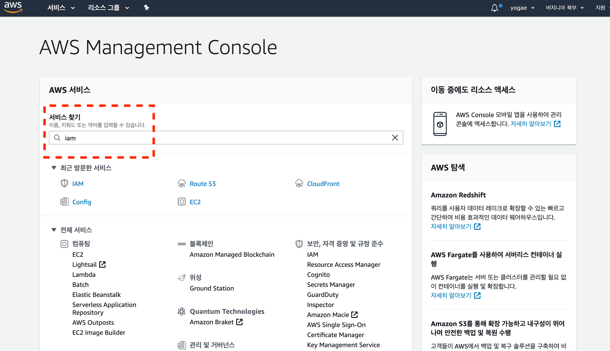
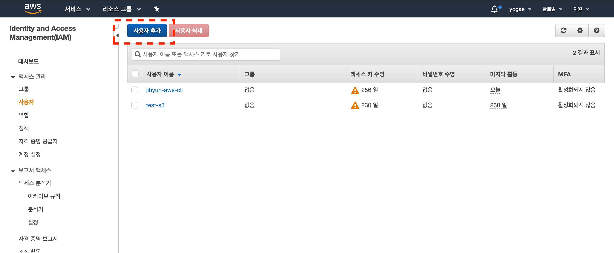
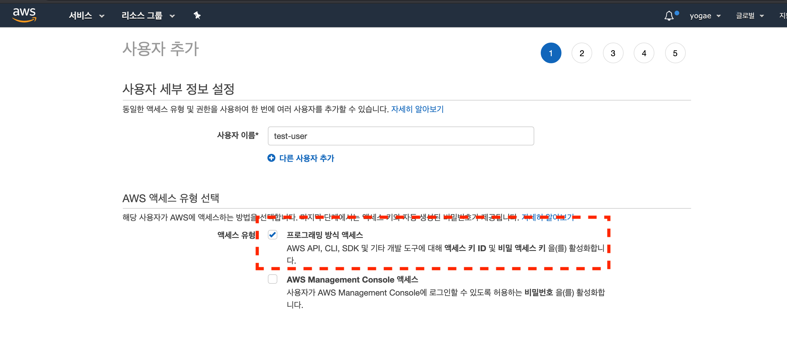
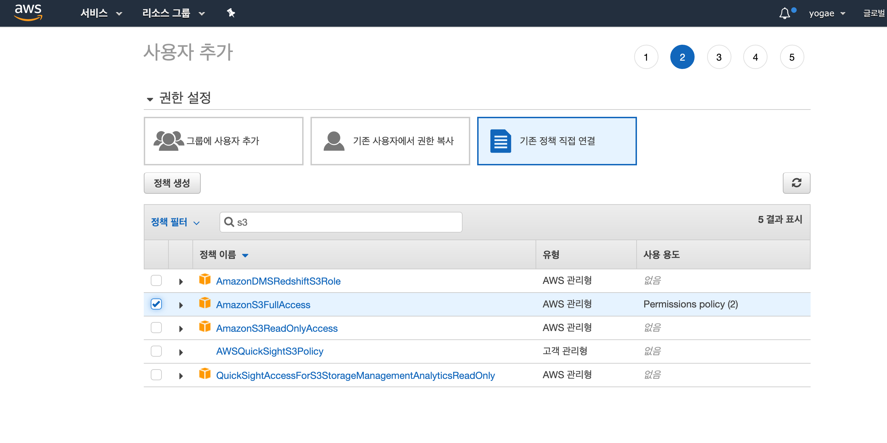
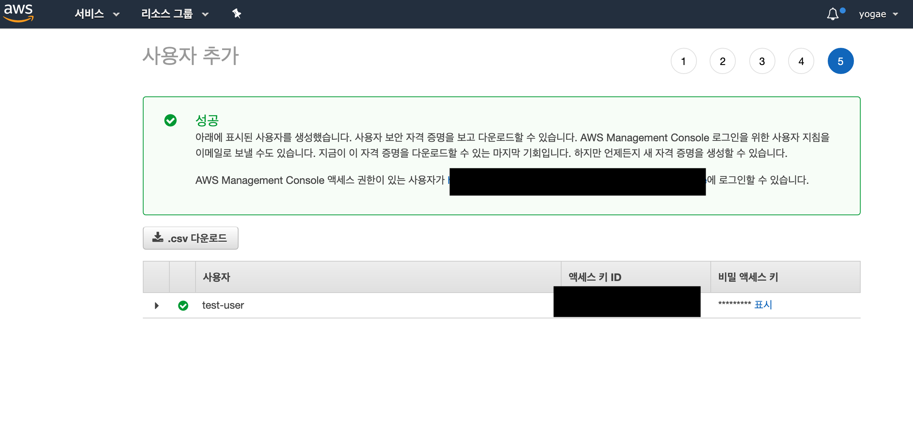

# AWS CLI

## 설치순서

1. [aws 계정 만들기](https://aws.amazon.com/ko/)
2. aws cli 설치
   - [Linux에 AWS CLI 버전 2 설치](https://docs.aws.amazon.com/ko_kr/cli/latest/userguide/install-cliv2-linux.html)
   - [macOS에 AWS CLI 버전 2 설치](https://docs.aws.amazon.com/ko_kr/cli/latest/userguide/install-cliv2-mac.html)
   - [Windows에 AWS CLI 버전 2 설치](https://docs.aws.amazon.com/ko_kr/cli/latest/userguide/install-cliv2-windows.html)
3. aws 사용자 만들기
   - iam 검색하고 클릭
      
   - aws 사용자 만들기
      
      
   - S3 권한 check
      
   - csv 다운받기
      
      **액세스 키 ID, 비밀 액세스 키는 정말 중요합니다. 절대 내 컴퓨터에서만 가지고 있고 외부 네트워크에 전송되지 않도록 주의해야한다.!!!!!**
4. aws configuring
   aws configuring을 설정해야만 자신의 컴퓨터에서 aws 계정에 접근하여 사용가능하다.

   - `cmd`창에서 `aws configure`명령어 실행

      ```bash
      AWS Access Key ID [None]: <3번 aws 사용자 만들기에서 다운 받은 csv에서 확인>
      AWS Secret Access Key [None]: <3번 aws 사용자 만들기에서 다운 받은 csv에서 확인>
      Default region name [None]: ap-northeast-2
      Default output format [None]: json
      ```

## 참고

- [aws configuring](https://docs.aws.amazon.com/cli/latest/userguide/cli-chap-configure.html)
