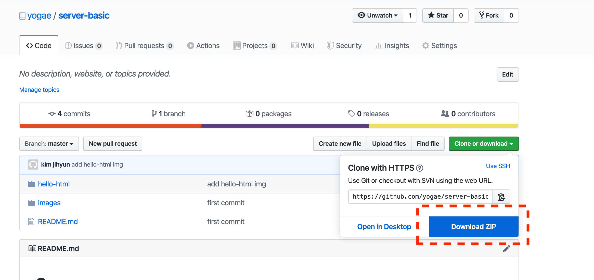
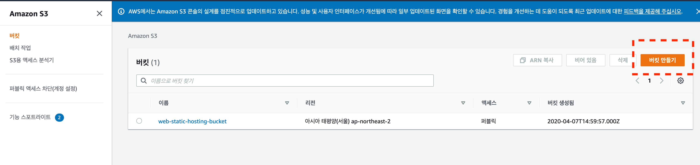
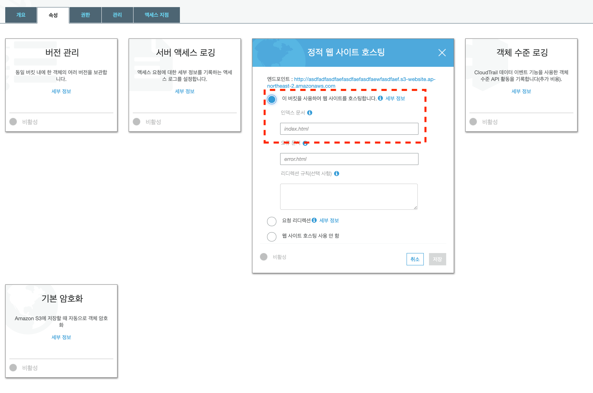
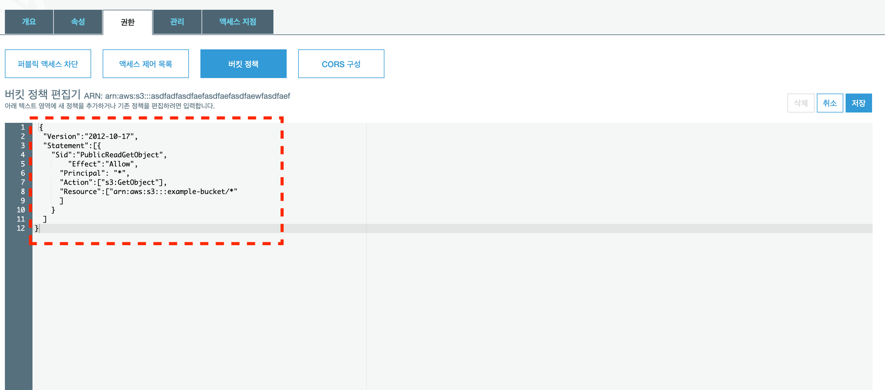
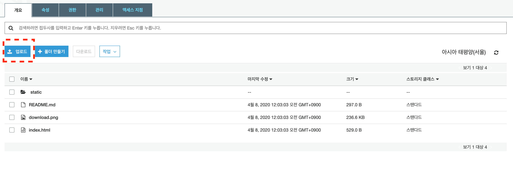

# Hello HTML

## 실행하는 방법

1. file을 다운받는다.
    
2. zip을 푼다.
3. 파일 탐색기에서 hello-html folder에 들어간다.
4. index.html 더블클릭

## AWS S3에 upload하기

1. AWS에서 `S3` 검색 클릭
2. `bucket 만들기` 클릭
3. `bucket 만들기`에서 아래 사진과 같이 설정
    
    - S3 bucket을 만들때 기본적으로 모든 접근이 차단되어 있음 -> 모든 퍼블리 엑세스 차단을 해제하여 public한 bucket을 만듦
    - S3 bucket 이름은 모든 사용자의 bucket 이름중에서 unique헤야함
4. S3 bucket에서 static hosting 설정하기
    
5. S3 bucket에서 access 권한 설정하기
    

    ```json
    {
        "Version":"2012-10-17",
        "Statement":[{
            "Sid":"PublicReadGetObject",
                "Effect":"Allow",
            "Principal": "*",
            "Action":["s3:GetObject"],
            "Resource":["arn:aws:s3:::example-bucket/*"
            ]
            }
        ]
    }
    ```

6. S3에 file upload
    
    - hello-html folder에서 `static` folder 와 index.html file을 upload한다.

## 숙제

html을 변경하고 다른 홈페이지 만들기!

## Reference

- [S3 web hosing](https://docs.aws.amazon.com/ko_kr/AmazonS3/latest/dev/WebsiteAccessPermissionsReqd.html)
